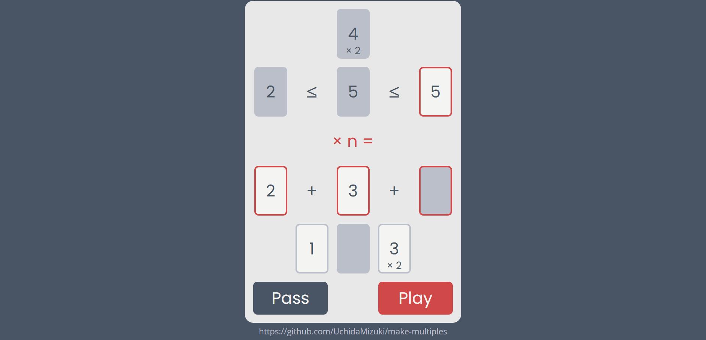

# Make Multiples

https://uchidamizuki.github.io/make-multiples/

## Game Rules

1. Deal a hand of cards to two players at random.
1. Put a card on the field at random.
1. Decide the turn.
1. On your turn,
    - choose some cards from your hand.
        - The total ranks must be a multiple of the rank of the highlighted card on the field.
    - Put the card on the field if the condition is true.
        - Arrange the cards in the field in order of decreasing rank.
    - You can draw a card at random and pass.
1. Opponent's turn is the same.
1. Repeat the above steps until either player runs out of cards in his or her hand.
1. The first player to run out of cards wins.
